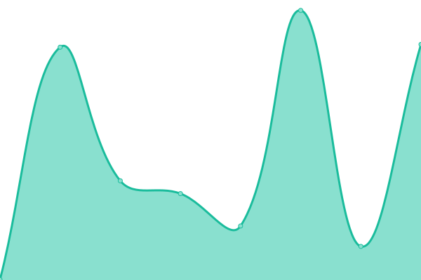

# [📈 Live Status](https://xup6sophia.github.io/upptime): <!--live status--> **🟧 Partial outage**

This repository contains the open-source uptime monitor and status page for [xup6sophia](https://xup6sophia.github.io/upptime), powered by [Upptime](https://github.com/upptime/upptime).

With [Upptime](https://upptime.js.org), you can get your own unlimited and free uptime monitor and status page, powered entirely by a GitHub repository. We use [Issues](https://github.com/xup6sophia/upptime/issues) as incident reports, [Actions](https://github.com/xup6sophia/upptime/actions) as uptime monitors, and [Pages](https://xup6sophia.github.io/upptime) for the status page.

<!--start: status pages-->
<!-- This summary is generated by Upptime (https://github.com/upptime/upptime) -->
<!-- Do not edit this manually, your changes will be overwritten -->
<!-- prettier-ignore -->
| URL | Status | History | Response Time | Uptime |
| --- | ------ | ------- | ------------- | ------ |
|  [invalidsite](https://thikkf356hfkkkkkkkkk.com/) | 🟥 Down | [invalidsite.yml](https://github.com/xup6sophia/upptime/commits/HEAD/history/invalidsite.yml) | 

 0ms
     
 | 

<a href="https://xup6sophia.github.io/upptime/history/invalidsite">100.00%</a>
    

|  [Youtube](https://www.youtube.com/) | 🟩 Up | [youtube.yml](https://github.com/xup6sophia/upptime/commits/HEAD/history/youtube.yml) | 

 275ms
     
 | 

<a href="https://xup6sophia.github.io/upptime/history/youtube">100.00%</a>
    

|  [NCU](https://www.ncu.edu.tw/tw/) | 🟩 Up | [ncu.yml](https://github.com/xup6sophia/upptime/commits/HEAD/history/ncu.yml) | 

 2097ms
     
 | 

<a href="https://xup6sophia.github.io/upptime/history/ncu">100.00%</a>
    

|  [BBC](https://www.bbc.com/news) | 🟩 Up | [bbc.yml](https://github.com/xup6sophia/upptime/commits/HEAD/history/bbc.yml) | 

 255ms
     
 | 

<a href="https://xup6sophia.github.io/upptime/history/bbc">100.00%</a>
    

|  [UDN](https://udn.com/news/index) | 🟩 Up | [udn.yml](https://github.com/xup6sophia/upptime/commits/HEAD/history/udn.yml) | 

 394ms
     
 | 

<a href="https://xup6sophia.github.io/upptime/history/udn">100.00%</a>
    

|  [CNN](https://edition.cnn.com/) | 🟩 Up | [cnn.yml](https://github.com/xup6sophia/upptime/commits/HEAD/history/cnn.yml) | 

 133ms
     
 | 

<a href="https://xup6sophia.github.io/upptime/history/cnn">100.00%</a>
    

<!--end: status pages-->

[**Visit our status website →**](https://xup6sophia.github.io/upptime)

## 📄 License

- Powered by: [Upptime](https://github.com/upptime/upptime)
- Code: [MIT](./LICENSE) © [xup6sophia](https://xup6sophia.github.io/upptime)
- Data in the `./history` directory: [Open Database License](https://opendatacommons.org/licenses/odbl/1-0/)
